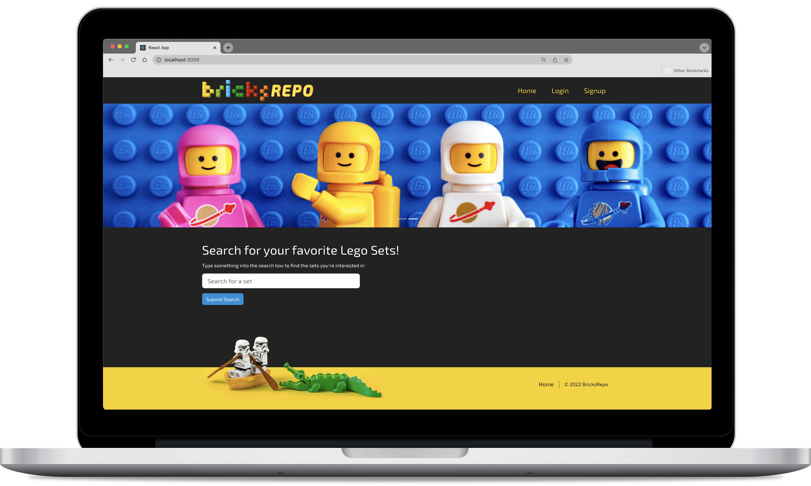

<a id="readme-top"></a>

<!-- PROJECT LOGO -->
<br />
<div align="center">


  <p align="center">
    <br />
    <br />
    <a href="https://bricks-repo.herokuapp.com/" target="_blank">View the application</a>
    <br />
    <br />
  </p>
</div>



<br>
<br>
<!-- TABLE OF CONTENTS -->
<details>
  <summary>Table of Contents</summary>
  <ol>
    <li><a href="#about-the-project">About The Project</a></li>
    <li><a href="#technologies">Technologies</a></li>
        <li><a href="#installation">Installation</a></li>
    <li><a href="#license">License</a></li>
    <li><a href="#contact">Contact</a></li>
  </ol>
</details>
<br />
<br />

<!-- ABOUT THE PROJECT -->
## About The Project

Lego’s history spans back to the early 20th century.  And throughout time, Lego has enjoyed steady growth while finding fun and exciting ways to be creative.  In today’s department stores, the Lego sets go well beyond the traditional Lego city and other “in-house” collections of 20 years ago.  There’s every kind of Lego to choose from, Marvel to DC, Harry Potter to Lord of the Rings, you name it, and they most likely have a collection with several sets available.  With over 1000 sets on the market to choose from, it can sometimes be challenging to keep up; this application hopes to help with that. 
<br />
<br />
As fellow Lego hobbyists, #bricklife, we created this application to allow you to create a user profile and search for your favorite sets. Eventually, it will feature the ability to save sets to your profile, search for instruction manuals, mini-figures, and more.  The app was built using the MERN stack with a React front end, MongoDB database, Node.js/Express.js server, GraphQL, and Apollo Server.


<br />


## Technologies

Frameworks/libraries used to bootstrap the project.

* [(M)ongoDB](https://www.mongodb.com/)
* [(E)xpress.js](https://expressjs.com/)
* [(R)eact.js](https://reactjs.org/)
* [(N)ode.js](https://nodejs.dev/en/)
* [GraphQL](https://www.apollographql.com/)
* [Bootstrap](https://getbootstrap.com/)


<br />

## Installation
<br>

1. Clone the repo
   ```sh
   git clone git@github.com:JimMason564/Project3.git
   ```
2. Install NPM packages
   ```sh
   npm install
   ```
3. Enter NPM start to run the application 
   ```
   npm start
   ```


<br />

<!-- LICENSE -->
## License

Distributed under the MIT License.
<br />
<br />

<!-- CONTACT -->
## Contact


- [@github/c1008h](https://github.com/c1008h) - Christina Hong
- [@github/JimMason564](https://github.com/JimMason564) - Jim Mason
- [@github/jnmayhook](https://github.com/jnmayhook) - Nathan Mayhook
- [@github/timmmmma](https://github.com/timmmmma) - Zhentian Chen
<br>
<br>

Deployed App: [https://bricks-repo.herokuapp.com/](https://bricks-repo.herokuapp.com/)
Project Repo: [https://github.com/JimMason564/Project3](https://github.com/JimMason564/Project3)


<p align="right">(<a href="#readme-top">back to top</a>)</p>
